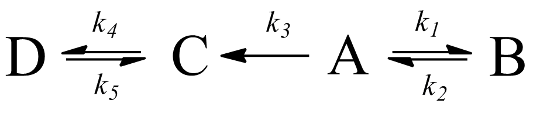
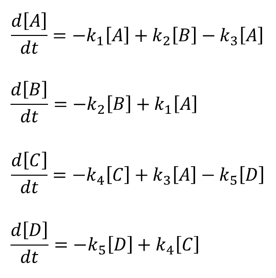

## Fitting raw kinetic data to a chemical reaction model in R

#### The following is a method of least squares parameter fitting for a system of ordinary differential equations that describe a user-defined kinetic model. The R code was adapted from a post by user *rdabbler* on the *R-bloggers* website. The original post can be viewed **[here](http://www.r-bloggers.com/learning-r-parameter-fitting-for-models-involving-differential-equations/).** 

### File list

`KS35pH7.csv` - representative raw concentration/time data

`ode_solve.R` - R code for kinetic parameter fitting

`Time_course.png` - representative plot produced by `ode_solve.R`

The proposed competitive reaction scheme is shown below.

  

Accordingly, the corresponding set of differential equations that describe the system above are as follows.

  

The objective is to determine the values of $k_1$, $k_2$, $k_3$, $k_4$ and $k_5$ that most accurately predict the concentrations $[A]$, $[B]$, $[C]$ and $[D]$ as a function of time.

The R code file reads raw concentration/time data in the following format.

time (hr) | A | B | C | D 
--- | --- | --- | --- | --- 
0 | 91.86 | 1.41 | 3.71 | 0 
1 | 92.47 | 1.85 | 3.14 | 0
2 | 90.89 | 2.46 | 3.77 | 0
... | ... | ... | ... | ...

The program floats a set of guessed k-values and solves the specified ODEs using the `deSolve` package. The `resid` function calculates the residual between measured concentrations and those determined from the ODE solutions. The residual is minimized using the Levenberg-Marquardt least squares algorithm by calling the `nls.lm()` function in the `minpack.lm` package. The parameter inputs to the minimization are the k-values. 

The resulting k-values, or rate constants, that minimize the residual are stored in the object `parest`. A full report of results is stored in the object `fitval`.

Results are plotted with the `ggplot2` package. The raw data are denoted by points and the overlaid curves represent the predicted concentrations as determined by parameter fitting.
